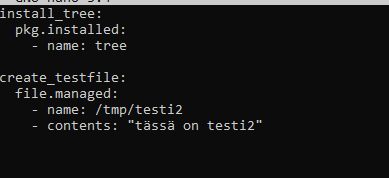

# Palvelinten Hallinta
## ICI001AS3A-3010
### Abdirahman Mire
## H2 INFRA-AS-CODE

## Taustatiedot

Tässä tehtävässä perehdyn lisää Saltstackin käyttöön.

## Työympäristö
Tehtävän tekoon käytin kotonani olevaa PC:tä:

Käyttöjärjestelmä: Windows 10 Pro 64-bit

Suoritin: Intel Core i7-4790

Muisti: 12GB DDR3

Näytönohjain: NVIDIA GeForce GTX 1050 Ti

Virtuaalinen kone: VirtualBoxin kautta asennettu Debian 12 Bookworm.

##  X) Tiivistelmä

- Vagrant mahdollistaa virtuaalisten Debian-koneiden luomisen ja hallinnan nopeasti VirtualBoxissa.
- Moduulit kannattaa luoda järjestelmällisesti omiin kansioihinsa, esim. /srv/salt/hello/init.sls, jotta koodi pysyy selkeänä ja hallitavana
- top.sls-tiedosto määrittää, mitä tiloja suoritetaan millä minioneilla.
- YAML-säännöt: välilyöntejä käytetään sisennykseen, rakennetaan avain-arvo-pareja, listoja ja sanakirjoja

## A) Hello Vagrant! Osoita jollain komennolla, että Vagrant on asennettu.

käytin komentoa `vagrant --version` joka kertoo asennetun vagrantin versionumero.

## B)Linux Vagrant. Tee Vagrantilla uusi Linux-virtuaalikone.

Loin hakemiston my-vagrant-vm ja siirryin hakemistoon komennoilla:

`mkdir my-vagrant-vm`

`cd my-vagrant-vm`

Tämän jälkeen loin VagrantFile tiedoston komennolla:

`vagrant init`

Vagrantfile:n luotuani lisäsin seuraavat määritelmät:

## C) Tee kahden Linux-tietokoneen verkko Vagrantilla. Osoita, että koneet voivat pingata toisiaan.

käytin komentoa `vagrant ssh t001` päästäkseni t001 virtuaalikoneelle ja pingasin t002 komennolla `ping -c 4 t002` ja sama toisin päin eli `vagrant ssh t002` ja pingasin `ping -c 4 t001`:

## D) Demonstroi Salt herra-orja arkkitehtuurin toimintaa kahden Linux-koneen verkossa, jonka teit Vagrantilla.

Asennettuani saltin annoin t001 virtuaalikoneelle masterin ja t002 minionin. 

Annoin minionin määritystiedostoon masterin osoitteen ja hyväksyin avaimen masterilla komennolla `sudo salt-key -A`

lopuksi pingasin t002 konetta t001 koneesta komennolla: `sudo salt t002 test.ping`

## E) Kokeile paikallisesti (esim 'sudo salt-call --local') infraa koodina. Kirjota sls-tiedosto, joka tekee esimerkkitiedoston /tmp/ -kansioon.

Loin kansion /srv/salt/ jonne loin sls moduulin "hello". Tähän sls tiedostoon lisäsin seuraavat määritykset: 

Suoritin komennon `sudo salt '*' state apply hello` joka loi tiedoston /tmp/infra-as-code onnistuneesti: 

## F) Aja esimerkki sls-tiedostosi verkon yli orjalla.

Ajoin komennon `sudo salt t002 state.apply hello` joka lähettää hello moduulin masterilta minionille ja ajaa sen siellä.

Tämän jälkeen tarkistin oliko tiedosto luotu minion koneella komennolla `ls /tmp/infra-as-code`

## G) Tee sls-tiedosto, joka käyttää vähintään kahta eri tilafunktiota näistä: package, file, service, user. Tarkista eri ohjelmalla, että lopputulos on oikea. Osoita useammalla ajolla, että sls-tiedostosi on idempotentti.

Loin uuden moduulin "testi2" joka asentaa tree paketin ja luo uuden tiedoston "testi2" seuraavilla määrityksillä:

Komennolla `sudo salt t002 state.apply testi2` lähetin moduulin minionille ajattavaksi. Toistin komennon saavuttaakseni idempotentti tilan: 

## H)Top file. Automatisoi vähintään kahden tilan / modulin ajaminen.

aloitin luomalla top.sls moduulin masterille komennolla `sudo nano /srv/salt/top.sls` ja lisäsin seuraavan: 

Loin testi3 moduulin komennolla `sudo nano /srv/salt/testi3` jonka tehtävänä on tulostaa tekstin "tämä on testi3"

Tämän jälkeen loin moduulin Apache komennolla `sudo nano /srv/salt/apache` ja laitoin seuraavat määritykset: 

luotuani nuo moduulit lähetin ja ajoin ne minion koneella komennolla: `sudo salt '*' state.apply`: 

virheestä huolimatta tämä ajoi molemmat moduulit minion koneella.

### Viitteet ja lähteet:

https://terokarvinen.com/2021/two-machine-virtual-network-with-debian-11-bullseye-and-vagrant/

https://terokarvinen.com/2018/salt-quickstart-salt-stack-master-and-slave-on-ubuntu-linux/?fromSearch=salt%20quickstart%20salt%20stack%20master%20and%20slave%20on%20ubuntu%20linux

https://terokarvinen.com/2024/hello-salt-infra-as-code/

https://terokarvinen.com/2023/salt-vagrant/#infra-as-code---your-wishes-as-a-text-file

https://terokarvinen.com/palvelinten-hallinta/

-“Tätä dokumenttia saa kopioida ja muokata GNU General Public License (versio 2 tai uudempi) mukaisesti. <http://www.gnu.org/licenses/gpl.html>”

