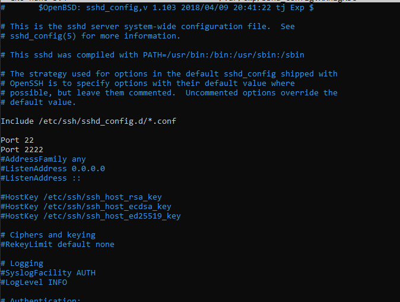

# Palvelinten Hallinta
## ICI001AS3A-3010
### Abdirahman Mire

## H3 Demoni

## Taustatiedot

Opettelen hallitsemaan palvelimia Saltin avulla, automatisoiden palveluiden asennukset ja konfiguraatiot. Harjoittelen asetusten määrittämistä tekstimuodossa, tilafunktioiden käyttöä ja varmistan, että palvelut pysyvät oikeassa tilassa. 

## Työympäristö

Tehtävän tekoon käytin kotonani olevaa PC:tä:

Käyttöjärjestelmä: Windows 10 Pro 64-bit

Suoritin: Intel Core i7-4790

Muisti: 12GB DDR3

Näytönohjain: NVIDIA GeForce GTX 1050 Ti

Virtuaalinen kone: VirtualBoxin kautta asennettu Debian 12 Bookworm.

## X) Tiivistelmä

- Artikkeli esittelee, kuinka hallita demoneja Salt-konfiguraationhallintajärjestelmällä noudattamalla "package-file-service" -kaavaa.
- Esimerkissä muutetaan SSH-palvelimen porttia ja testataan onnistunut muutos käyttäen Saltin tilaa (sshd.sls ja konfiguraatiotiedostoa /srv/salt/sshd_config).

## A) Apache easy mode. Asenna Apache, korvaa sen testisivu ja varmista, että demoni käynnistyy.

Aloitin tarkistamalla päivitykset `sudo apt update` ja asensin apachen `sudo apt install apache2 -y`

Korvasin Apache-palvelimen oletussivun yksinkertaisella "Hello, World" -viestillä komennolla: `echo "Hello, World from Apache!" | sudo tee /var/www/html/index.html` 

Varmistin, että Apache-palvelin käynnistyy ja käynnistyy automaattisesti uudelleen järjestelmän bootin jälkeen seuraavilla komennoilla: `sudo systemctl start apache2` ja `sudo systemctl enable apache2` 

Lopuksi testasin että palvelin toimii komennolla `curl http://localhost` ja palvelin vastasi onnistuneesti kotisivun sisällöllä

Seuraavaksi automatisoin saman prosessin Saltin SLS-tiedostoa käyttäen.

Loin tiedoston nimeltä apache.sls seuraavalla sisällöllä:

jonka jälkeen ajoin komennon `sudo salt '*' state.apply apache` onnnistuneesti: 

Lopuksi testasin palvelimen toimintaa curl-komennolla: `curl http://localhost`

## B) SSHouto. Lisää uusi portti, jossa SSHd kuuntelee.

Aloitin avaamalla ssh asetustiedoston komennolla `sudoedit /etc/ssh/sshd_config` ja lisäsin toisen portin "2222" 

Käynnistin SSH-palvelimen uudelleen, jotta muutokset astuvat voimaan: `sudo systemctl restart sshd`

Testasin onko portti käytössä komennoilla: `nc -vz localhost 2222` ja `ssh -p 8888 user@localhost`

Seuraavaksi automatisoin prosessin luomalla sls tiedoston.

loin tiedoston "ssh.sls" johon lisäsin seuraavat määritykset: 

Tässä pkg.installed varmistaa että openssh-server on asennettu, file.managed varmistaa että sshd_config tiedosto on oikeassa tilassa ja service.running varmistaa että SSH-palvelu pysyy käynnissä ja käynnistetään uudelleen jos asetustiedosto puuttuu.

Tämän jälkeen loin /srv/salt/ssh/sshd_config seuraavilla määrityksillä: 

Lopuksi ajoin luomani sls tiedoston onnistuneesti komennolla `sudo salt '*' state.apply ssh`

## Lähteet: 
Karvinen 2018: Pkg-File-Service – Control Daemons with Salt – Change SSH Server Port. Luettavissa: https://terokarvinen.com/2018/04/03/pkg-file-service-control-daemons-with-salt-change-ssh-server-port/?fromSearch=karvinen%20salt%20ssh. 

