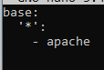
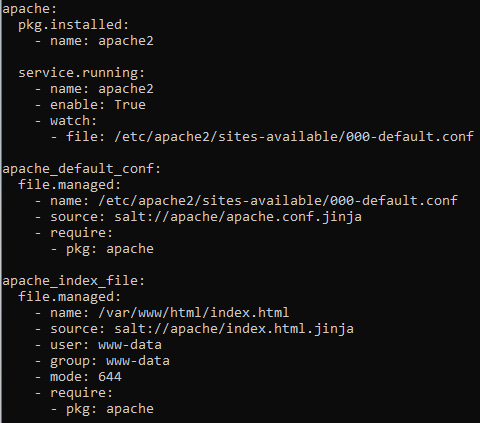

# Palvelinten Hallinta
**ICI001AS3A-3010**  
**Abdirahman Mire**  
**My Module: Apache**  

## Työympäristö  
Tehtävän toteutin omalla työasemallani:  
- **Käyttöjärjestelmä:** Windows 10 Pro 64-bit  
- **Suoritin:** Intel Core i7-4790  
- **Muisti:** 12 GB DDR3  
- **Näytönohjain:** NVIDIA GeForce GTX 1050 Ti  
- **Virtuaalikone:** VirtualBoxilla asennettu Debian 12 Bookworm  

## Tiivistelmä  

Tässä raportissa luodaan SaltStack-moduuli, joka automatisoi Apache2-web-palvelimen asennuksen ja konfiguroinnin. Moduuli hallitsee Apache2:n asennusta, VirtualHost-konfiguraation luomista ja mukautetun index.html-sivun kopioimista palvelimelle. Moduuli takaa idempotenssin, eli ympäristön pysyvyyden toistuvilla ajokerroilla. Haluan vielä mahdollisesti lisätä wordpressin, gitlabin ja nextcloudin, jolloin tästä tulisi isompi kokonaisuus.

### A) Apache-moduulin luominen  
 
Loin `/srv/salt/apache/`-hakemiston Salt-moduulille.  

`sudo mkdir -p /srv/salt/apache`

Tähän ensin loin top.sls tiedoston joka ohjaa mitä tiloja sovelletaan mihinkin koneeseen.

Loin init.sls tiedoston johon lisäsin kaikken tarvittavan Apache-palvelimen asentamiseksi ja konfiguroimiseksi. 

`sudoedit init.sls`

Seuraavaksi Loin apache.conf.jinja tiedoston joka on VirtualHost-konfiguraatiotiedosto apachelle. Tämä määrittää palvelimen juurihakemiston ja lokitiedostojen sijainnit.

 `sudoedit apache.conf.jinja`

Tämän luotuani vuorossa oli index.html.jinja tiedosto, joka näkyy Apache-palvelimen etusivulla.

`sudoedit index.html.jinja`

Kun sain nämä Apache määritykset tehtyä, ajoin init.sls tiedoston paikallisesti varmistaakseni että se toimii. Ennen tätä käynnistin palvelimen uudestaan.

`sudo systemctl restart apache`
`sudo salt-call --local state.apply apache`

Neljästä vain kolme changed koska Apache oli jo asennettuna.

Lopuksi ajoin komennon `sudo salt '*' state.apply` masterilla kahdesti saavuttaakseni idempotenssin.

Kokeilin vielä verkkosivua selaimella:

